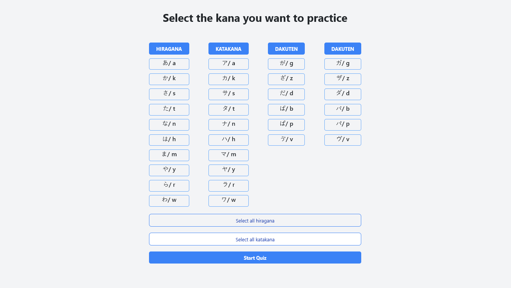

# 🎌 Hiragana & Katakana Quiz App

A single-page application (SPA) designed for learning and practicing Japanese Hiragana and Katakana characters. Built using React, this interactive app allows users to customize their quiz settings and test their knowledge of Japanese scripts.

---

## 🌟 Features

- **Character Selection**: Choose which Hiragana and/or Katakana characters to include in the quiz.
- **Quiz Mode**: Test yourself with randomly generated character questions.
- **Progress Tracking**: View your correct and incorrect answers in real-time.
- **User-Friendly Interface**: Simple and intuitive design for seamless learning.

---

## 📂 Project Structure
```plaintext
project-root/
├── public/
├── src/
│   ├── components/
│   │   ├── AnswerHistory.jsx
│   │   ├── Form.jsx
│   │   ├── KanaCard.jsx
│   ├── features/
│   │   ├── Dictionary/
│   │   │   └── Dictionary.jsx
│   │   ├── Quiz/
│   │   │   ├── Quiz.jsx
│   │   │   └── QuizController.jsx
│   ├── styles/
│   │   ├── App.css
│   │   └── Quiz.css
│   ├── App.jsx
│   └── index.js
├── package.json
└── README.md
```

---

## 🛠 Installation

### 1️⃣ Clone the Repository
```bash
git clone https://github.com/your-username/hiragana-katakana-quiz.git
cd hiragana-katakana-quiz
```

### 2️⃣ Install Dependencies
```bash
npm install
```

### 3️⃣ Start the Application
```bash
npm start
```
The app will run on [http://localhost:3000](http://localhost:3000).

---

## 🚀 How to Use

1. **Select Characters**: Use the character selector to pick which Hiragana/Katakana characters you want to practice.
2. **Start Quiz**: Click the "Start Quiz" button to begin testing your knowledge.
3. **Answer Questions**: For each question, select the correct romanized equivalent or matching character.
4. **View Results**: At the end of the quiz, see your score and review any mistakes.

---

## 🖼️ Screenshots

### Character Selector


### Quiz in Action


---

## 🔧 Technologies Used

- **React**: Frontend framework for building the SPA.
- **Tailwind**: Styling for a modular and maintainable design.

---

## 🤝 Contribution

We welcome contributions! To contribute:
1. Fork the repository.
2. Create a new branch (`git checkout -b feature-branch-name`).
3. Make your changes and commit (`git commit -m "Add your message"`).
4. Push to your branch (`git push origin feature-branch-name`).
5. Create a pull request.

---

## 📜 License

This project is licensed under the MIT License. See the [LICENSE](./LICENSE) file for details.

---

## 💡 Acknowledgments

This app is inspired by the joy of learning Japanese and the desire to make language learning engaging and fun.

---

**Start your journey to mastering Hiragana & Katakana today! 🌸**
